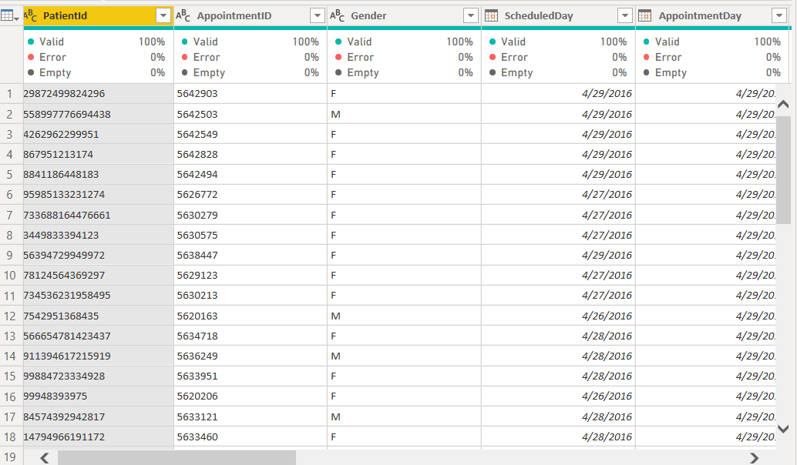
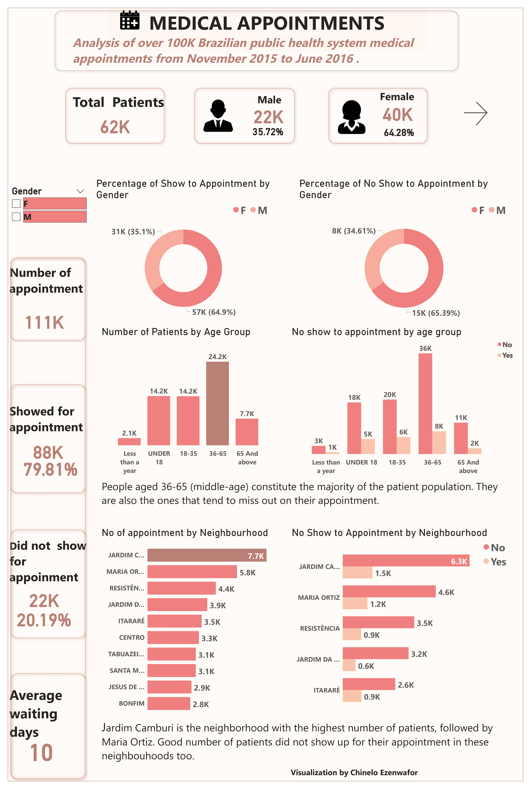

# No-Show-Dataset

# No-Show-Dataset

## by Chinelo Cynthia Ezenwafor

***

## INTRODUCTION

> The No-show appointment dataset collected information in Brazil for about 100,000 medical appointments from November 2015 to June 2016. The primary focus is on patients who meet or fail to meet up with their doctor's appointment. Link to the dataset can be found [here](https://docs.google.com/spreadsheets/d/1gDyi_L4UvIrLTEC6Wri5nbaMmkGmLQBk-Yx3z0XDEtI/edit#gid=0). The entire analysis for this project was done on Microsoft Power BI using power query and visualized using Microsoft Power BI.

## Problem Statement
The goal of the analysis is to:
- Understand the factors influencing patient attendance and no-show rates for medical appointments in Brazil
- Develop recommendations for improving attendance and reducing no-show rates, with a focus on addressing disparities by gender and age groups.

## Skills/concepts demonstrated:

The following Power BI skills were incorporated; 
- Data cleaning using power query 
- Creating and managing a calendar table
- Performing advanced DAX calculations for measures and other mathematical formulas 
- Data Visualization

## Data Importation

> Data was successfully imported and loaded into Power BI via excel. I transformed it using power query by changing to appropriate data type and correcting some inconsistencies in the age column. 

## Data Modelling
> No modelling was done except for the relationship that was established between the dataset and the calendar table.

## Data Analysis and Visualization

I created a two-page report which would be shown below:
- First page

- Second page

***

## Key Insights

- There are a total of 62k patients, of which 22k(35%) are males while 42k (65%) are females.                                                              
- A total of 111K appointments were booked, 88k(79.81%) showed up for their appointment while 22k(20.19%) did not show for their appointment. 
- 64.9% of patients that kept to appointment were females  while 34.1% of them were males.                                                  
- Patients aged 36-65 years make up the bulk of the patients numbering about 24.2k, we also have more of people from this age group missing their appointment. 
- Jardim Camburi is the neighborhood with the most patients booking appointments followed by Maria Ortiz. A good number of patients did not show up for their appointments in these neighborhoods well. 
- Majority of the patients are not on the Brazilian welfare scheme and did not receive an SMS reminder for their appointment. However, a large number of patients who are on the scheme/ received an SMS reminder for their appointment still missed their appointment. 
- Tuesdays and Wednesdays are the days with the highest number of appointments and patient turnout, Mondays and Fridays are when patients miss their appointment the most, this could be due to the 'Weekend effect" for Fridays and busy start of the week for Mondays. No appointments are scheduled for the weekends. 
- No show to appointments occurs mostly with longer waiting days. This shows that the longer the time between Scheduled day (day a patient books an appointment) and appointment day (day appointment is given), the higher the chances are that a patient would miss the appointment.

## Recommendation

- The gender distribution is uneven, so it may be worth investigating why there is a higher percentage of female patients and see if there are any steps that can be taken to encourage more male patients to seek medical care. They could be target interventions or campaigns specifically towards the male population in order to encourage them to attend their appointments. This could include targeted messaging, education about the importance of attending appointments, or other incentives that may motivate them to attend. Additionally, it may be helpful to gather more data on the reasons why males tend to miss their appointments more frequently in order to develop more targeted and effective strategies.

- The no-show rate is quite high, and it may be worth investigating why so many patients are missing their appointments. There could be a variety of reasons for this, including lack of access to transportation, financial constraints, or forgetfulness. I would also recommend exploring ways to remind patients about their appointments or reducing barriers to accessing healthcare.

- The age group of 36-65 is the largest patient group and also the age group that has the highest number of missed appointments. It may be worth focusing on this group and trying to understand why they are more likely to miss their appointments, such as having competing priorities or difficulties with meeting up with appointments.

- Since Jardim Camburi has the most patients, it may be worth prioritizing this neighborhood for outreach and engagement efforts.

- Even though patients on the Brazilian welfare scheme or who received an SMS reminder for their appointment are less likely to miss their appointments, there are still a significant number who do. It may be worth investigating why this is the case and exploring additional ways to support these patients. Since SMS reminder didn't work as anticipated, Emails can be  incorporated with google calendar reminder, phone calls can also be implemented.

- Based on the appointment date data, it appears that Mondays and Fridays are the days with the highest number of no-shows. Exploring ways to reduce barriers to access or offering incentives to patients who show up for appointments on these days can help reduce no show to appointments.

- Patients who have long waiting days are more likely to miss their appointments. It may be worth exploring ways to reduce wait times or providing additional support to patients who have to wait longer than usual.

- Make virtual visits possible through e-consultation, these sessions ensure that patients can connect to doctors/physicians through audio or video call. This can be a great substitute for face to face meetings in non-emergency scenarios such as follow-ups etc 

## Conclusion 

>* I encountered several challenges during the analysis of this dataset, but I found the process enjoyable since it is in the domain of healthcare analysis, which I am passionate about. Thank you for taking the time to read through, and if you found it helpful, please consider leaving a star.

